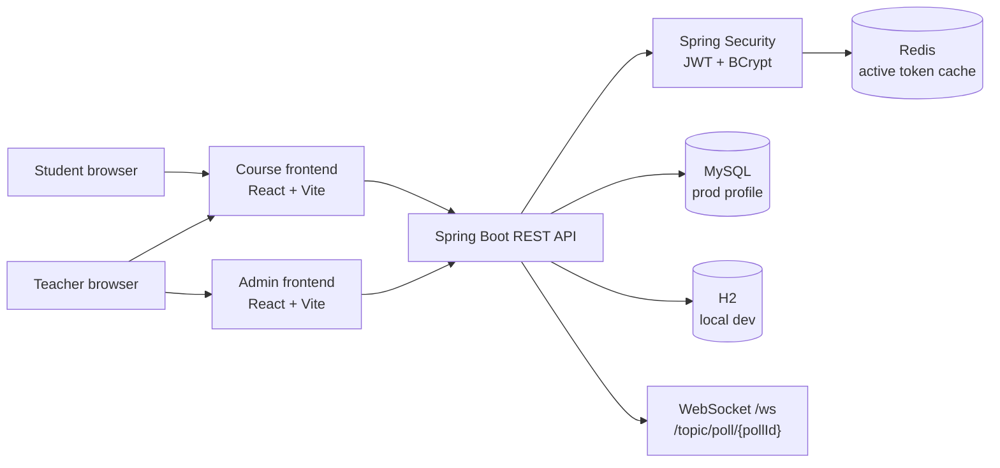

<div align="center">

# Course Website

A full-stack online learning platform with Spring Boot REST APIs, React frontends, JWT auth, Redis token sessions, MySQL persistence, and Docker Compose deployment.


[Overview](#overview) · [Features](#features) · [Architecture](#architecture) · [Quick start](#quick-start) · [CI/CD](#cicd) · [API reference](#api-reference) · [Testing](#testing)

</div>

---

## Overview

Course Website is an online learning platform for students and teachers. Students can browse lectures, view materials, vote in polls, comment on content, and review their voting history. Teachers can manage lectures, course materials, polls, and users through protected admin workflows.

The backend is a Spring Boot application exposing REST APIs secured with Spring Security and JWT. The frontend is split into two React + Vite apps: one admin frontend for teacher account management and one course frontend for student and teacher learning workflows. Docker Compose runs the backend, MySQL, Redis, and both frontend apps together.

## Features

| Area | What it does | Main files or modules |
| --- | --- | --- |
| Course content | Lectures, lecture details, material uploads, and comments | `LectureController`, `LectureService`, `course-frontend/src/pages/LectureDetailPage.jsx` |
| Polls | Poll listing, voting, vote updates, comments, and vote history | `PollController`, `PollService`, `course-frontend/src/pages/PollDetailPage.jsx` |
| Student workspace | React course homepage, lecture pages, poll pages, profile, and my votes | `course-frontend/src/pages` |
| Teacher dashboard | Teacher-only dashboard for lectures and polls | `AdminContentController`, `course-frontend/src/pages/DashboardPage.jsx` |
| Admin frontend | User listing, creation, editing, password updates, and deletion | `AdminUserController`, `admin-frontend/src/pages` |
| Auth | Spring Security, BCrypt passwords, JWT login, Redis-backed active token cache, logout invalidation | `SecurityConfig`, `JwtTokenService`, `TokenSessionService`, `RedisJwtDecoder` |
| Realtime updates | Backend WebSocket support for poll result updates | `WebSocketConfig`, `PollUpdateMessage` |
| Operations | Docker Compose for app, MySQL, Redis, admin frontend, course frontend, and GitHub Actions CI/CD | `docker-compose.yml`, `Dockerfile`, `.github/workflows/ci.yml` |

## Architecture



### Auth flow

1. Login or register creates a signed JWT.
2. The JWT includes a `jti` claim, which is a unique token id.
3. Redis stores `auth:token:{jti} -> username` with the same TTL as the JWT.
4. Protected API requests verify the JWT signature and expiration first, then check Redis to confirm the token is still active.
5. Logout deletes the Redis token record, so the old JWT is rejected even before it expires.

## Tech stack

| Layer | Technology |
| --- | --- |
| Backend | Java 17, Spring Boot 3.4, Spring MVC, Spring Security, OAuth2 Resource Server JWT, Spring Data JPA, WebSocket |
| Frontend | React, Vite, React Router, custom CSS |
| Database | H2 for local development, MySQL 8 for Docker/prod profile, Flyway migrations |
| Cache/session | Redis 7 for JWT token session caching |
| Testing | JUnit 5, Spring Boot Test, MockMvc, Spring Security Test, Mockito |
| Tooling | Gradle, Docker, Docker Compose, GitHub Actions CI |

## Project structure

```text
.
├── admin-frontend/          # React admin app for teacher-only user management
├── course-frontend/         # React course app for students and teachers
├── src/main/java/...        # Spring Boot backend
│   ├── config/              # Security, JWT, WebSocket, OpenAPI, MVC config
│   ├── controller/          # MVC controllers and REST API controllers
│   ├── dto/                 # API, admin, and WebSocket DTOs
│   ├── model/               # JPA entities
│   ├── repository/          # Spring Data repositories
│   └── service/             # Business logic, JWT, Redis token sessions
├── src/main/resources/      # Application config, i18n, Flyway migrations
├── docker-compose.yml       # MySQL, Redis, backend, and frontend services
└── build.gradle             # Backend dependencies and test setup
```

## Quick start

### Option 1: Run everything with Docker Compose

Copy the environment template:

```powershell
Copy-Item .env.example .env
```

For macOS/Linux:

```bash
cp .env.example .env
```

Update the secrets in `.env`, especially `MYSQL_ROOT_PASSWORD`, `DB_PASSWORD`, and `JWT_SECRET`. Then start the stack:

```bash
docker compose up --build
```

Open the apps:

| App | URL |
| --- | --- |
| Course frontend | `http://localhost:5174` |
| Admin frontend | `http://localhost:5173` |
| Spring Boot API | `http://localhost:8080` |
| Swagger UI | `http://localhost:8080/swagger-ui.html` |
| Health check | `http://localhost:8080/actuator/health` |

Docker Compose starts:

- `coursewebsite-app` on port `8080`
- `coursewebsite-db` on host port `3307` by default
- `coursewebsite-redis` on host port `6379`
- `coursewebsite-admin-frontend` on port `5173`
- `coursewebsite-course-frontend` on port `5174`

### Option 2: Run the backend locally

Windows:

```powershell
.\gradlew.bat bootRun
```

macOS/Linux:

```bash
./gradlew bootRun
```

This uses the local H2 database by default:

```text
JDBC URL: jdbc:h2:file:./coursewebsite_db
Username: sa
Password: password
```

### Option 3: Run the React apps locally

Admin frontend:

```bash
cd admin-frontend
npm install
npm run dev
```

Course frontend:

```bash
cd course-frontend
npm install
npm run dev
```

## Default accounts

The backend seeds these accounts when the user table is empty:

| Role | Username | Password |
| --- | --- | --- |
| Student | `student` | `password` |
| Teacher | `teacher` | `password` |

## Configuration

| Variable | Default or example | Purpose |
| --- | --- | --- |
| `DB_HOST` | `db` in Docker, `localhost` locally | MySQL host for prod profile |
| `DB_PORT` | `3306` in Docker, `3307` from host | MySQL port |
| `DB_NAME` | `coursewebsite` | MySQL database name |
| `DB_USERNAME` | `appuser` | MySQL application user |
| `DB_PASSWORD` | `<set locally>` | MySQL application password |
| `MYSQL_ROOT_PASSWORD` | `<set locally>` | MySQL root password for Docker |
| `JWT_SECRET` | `<at least 32 characters>` | HMAC secret for JWT signing |
| `JWT_TTL_MINUTES` | `120` | JWT and Redis token session TTL |
| `REDIS_HOST` | `redis` in Docker, `localhost` locally | Redis host |
| `REDIS_PORT` | `6379` | Redis port |
| `CORS_ALLOWED_ORIGINS` | `http://localhost:5173,http://localhost:5174` | Allowed React frontend origins |
| `ADMIN_FRONTEND_HOST_PORT` | `5173` | Admin frontend host port |
| `COURSE_FRONTEND_HOST_PORT` | `5174` | Course frontend host port |

## API reference

### Public and student APIs

| Method | Endpoint | Purpose |
| --- | --- | --- |
| `POST` | `/api/auth/login` | Login and receive a JWT |
| `POST` | `/api/auth/register` | Register and receive a JWT |
| `GET` | `/api/auth/me` | Read current user |
| `POST` | `/api/auth/logout` | Delete the active Redis token session |
| `GET` | `/api/v1/lectures` | List lectures |
| `GET` | `/api/v1/lectures/{lectureId}` | Get lecture details |
| `POST` | `/api/v1/lectures/{lectureId}/comments` | Add lecture comment |
| `GET` | `/api/v1/polls` | List polls |
| `GET` | `/api/v1/polls/{pollId}` | Get poll details |
| `POST` | `/api/v1/polls/{pollId}/vote` | Submit or update a vote |
| `POST` | `/api/v1/polls/{pollId}/comments` | Add poll comment |
| `GET` | `/api/v1/profile` | Read profile |
| `PUT` | `/api/v1/profile` | Update profile |
| `GET` | `/api/v1/me/votes` | Read vote history |

Example login:

```bash
curl -X POST http://localhost:8080/api/auth/login \
  -H "Content-Type: application/json" \
  -d '{"username":"student","password":"password"}'
```

Example authenticated vote:

```bash
curl -X POST http://localhost:8080/api/v1/polls/1/vote \
  -H "Content-Type: application/json" \
  -H "Authorization: Bearer <jwt>" \
  -d '{"optionId":1}'
```

### Teacher and admin APIs

| Method | Endpoint | Purpose |
| --- | --- | --- |
| `POST` | `/api/admin/auth/login` | Teacher login for admin API |
| `GET` | `/api/admin/users` | List users |
| `GET` | `/api/admin/users/{id}` | Get one user |
| `POST` | `/api/admin/users` | Create user |
| `PUT` | `/api/admin/users/{id}` | Update user profile and roles |
| `PUT` | `/api/admin/users/{id}/password` | Update user password |
| `DELETE` | `/api/admin/users/{id}` | Delete user |
| `GET` | `/api/teacher/content/dashboard` | Read teacher dashboard content |
| `POST` | `/api/teacher/content/lectures` | Create lecture |
| `DELETE` | `/api/teacher/content/lectures/{id}` | Delete lecture |
| `POST` | `/api/teacher/content/polls` | Create poll |
| `DELETE` | `/api/teacher/content/polls/{id}` | Delete poll |

Only users with `ROLE_TEACHER` can access teacher/admin endpoints.

## WebSocket poll updates

The backend exposes a SockJS/STOMP endpoint at:

```text
/ws
```

Poll updates are published to:

```text
/topic/poll/{pollId}
```

The message payload is `PollUpdateMessage`, which includes the poll id, total votes, and per-option vote counts and percentages.

## CI/CD

GitHub Actions runs the project pipeline from `.github/workflows/ci.yml`.

| Trigger | What runs |
| --- | --- |
| Pull request to `main` | Backend Gradle build, both frontend production builds, and Docker image build checks |
| Push to `main` | Same checks, then Docker images are published to GitHub Container Registry |

The workflow has three jobs:

- `backend`: sets up Java 17 and runs `./gradlew build`.
- `frontend`: uses a matrix to build both `admin-frontend` and `course-frontend` with Node.js 22.
- `docker`: builds backend, admin frontend, and course frontend Docker images after the app builds pass.

## Testing

Backend test suite:

```powershell
.\gradlew.bat test
```

Backend full build:

```powershell
.\gradlew.bat build
```

Frontend production builds:

```bash
cd admin-frontend
npm run build

cd ../course-frontend
npm run build
```

GitHub Actions runs backend, frontend, and Docker build checks on pull requests and pushes to `main`.

## Troubleshooting

| Problem | Fix |
| --- | --- |
| MySQL port conflict | Keep `MYSQL_HOST_PORT=3307` in `.env`, or choose another free host port. |
| Redis connection refused locally | Start Redis with `docker compose up -d redis`, or set `REDIS_HOST` and `REDIS_PORT` to your running Redis instance. |
| JWT rejected after logout | This is expected. Logout deletes the Redis token session, so the old JWT cannot be reused. |
| Frontend gets CORS errors | Add the frontend origin to `CORS_ALLOWED_ORIGINS`. |
| H2 console cannot connect | Use `jdbc:h2:file:./coursewebsite_db`, username `sa`, password `password`. |

## Security notes

- Passwords are hashed with BCrypt.
- JWTs are signed with HS256 and require a strong `JWT_SECRET` outside local development.
- Redis stores active token ids, not plaintext passwords.
- Logout invalidates the Redis token session immediately.
- `.env` contains local secrets and should not be committed.
